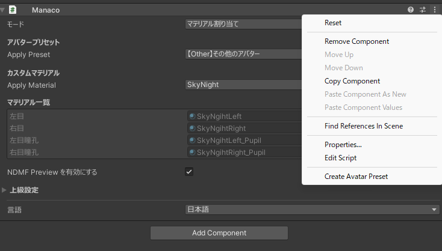

## このページでやること

このページでは、アバター配布者向けに `ManacoPreset` の作り方と、配布時に気を付けることを説明します。  
購入者や利用者がMANACOを使いやすくなるように、目の設定を `.asset` として同梱する流れです。

## `ManacoPreset` とは

`ManacoPreset` は、アバターのどの部分を左目・右目・瞳孔として扱うかを保存するためのアセットです。

- 目のUV位置を保存できます。
- 利用者側で手動設定する手間を減らせます。
- `.asset` としてアバターに同梱して配布できます。

## はじめる前に

- MANACOをインストール済みであること。
- 配布したいアバターをUnityで開いていること。
- どの部分を左目・右目・瞳孔として扱うか把握していること。

## 手順1: MANACOを追加する

1. Hierarchyで対象アバターを右クリックします。
2. `ちゃとらとりー/Manaco(まなこ)` を実行します。
3. 生成された `Manaco` オブジェクトを選択します。

## 手順2: 配布用の設定を始める

1. `アバタープリセット` に `【Other】その他のアバター` を選択します。
2. 左目・右目・必要であれば瞳孔の `選ぶ` ボタンを順番に押します。
3. UVエディタで対応する目のUV Islandを設定します。

## 手順3: 名前を整える

1. 生成された `Manaco` オブジェクトの名前をわかりやすく変更します。
2. 必要であれば `英語名 日本語名` のように、購入者が判別しやすい名前にします。

この名前は、プリセットを書き出した後の識別にも使いやすいため、保存前に整えておくのがおすすめです。

## 手順4: プリセットを書き出す

1. `Manaco` コンポーネント右上のメニューを開きます。
2. `Create Avatar Preset` を実行します。
3. 保存先を選んで `.asset` として保存します。

## 手順5: 配布物に同梱する

1. 作成した `ManacoPreset` をアバター配布物に含めて配布してください。
2. MANACOはプロジェクトのどの場所に置いていても動作するため、管理しやすい場所に入れてください。

## 注意点

- `ManacoPreset` に保存されるのは主に目のUV座標情報です。
- 3Dモデルそのものやメッシュ全体を再現できるデータではありません。
- プリセットはオブジェクト名を参照するため、モデルそのものの構造やオブジェクト名を変えると再マッピングが必要になる場合があります。
- 配布前に、実際に新規プロジェクト相当の状態で読み込めるか確認してください。

## 配布について

- `ManacoPreset` を配布することはどなたでも可能です。
- ただし、元アバターの利用規約は必ず確認してください。
- プリセットに含まれる情報の扱いも、最終的にはアバター側の利用規約に従ってください。
