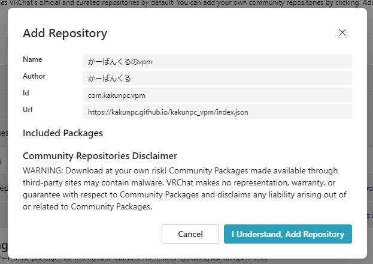
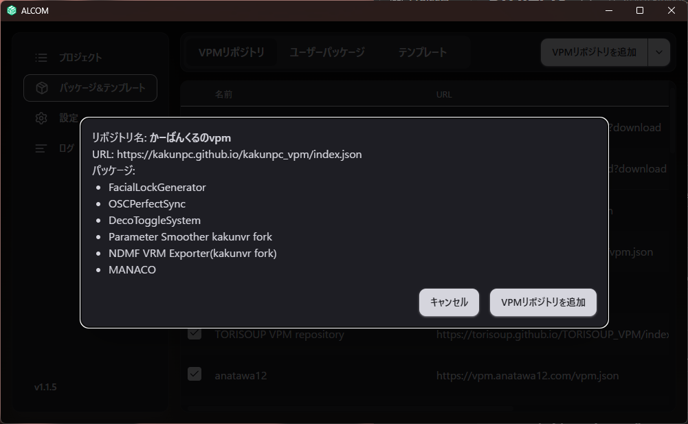
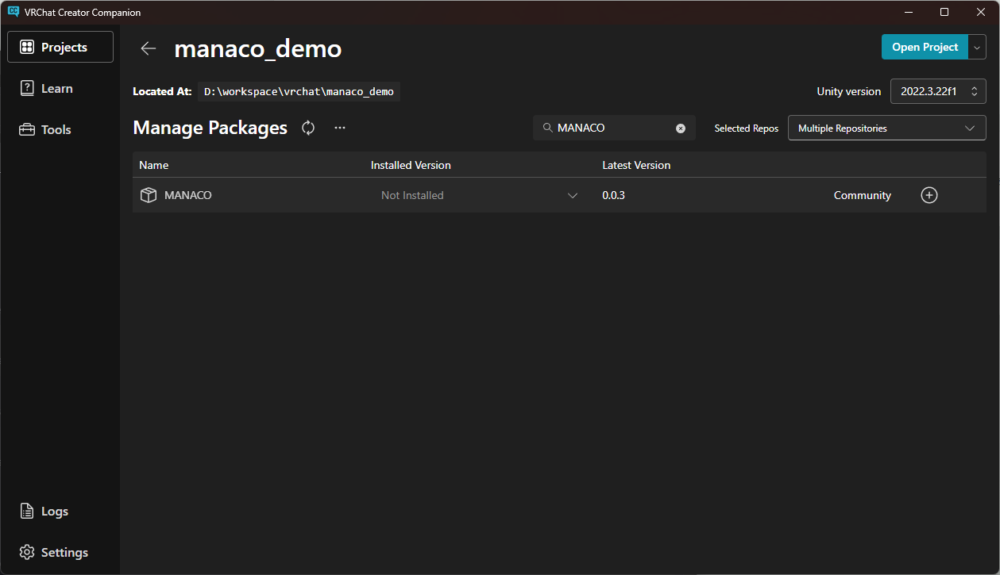
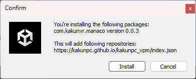

## このページでやること

MANACOを使い始める前に、必要なものを確認して、Unityプロジェクトへ導入します。  
初めて触る場合は、まずこのページの手順どおりに進めてください。

## 注意点

インストールする場合は必ずこの手順で案内している方法で行ってください。    
BoothやGithubのリリースページ以外からの入手は、セキュリティ上のリスクがあるためおすすめしません。  
本ツールはここで書かれている方法以外での配布手段は提供していません。

## おすすめの導入方法

初めて使う場合は、`VCC・ALCOM` での導入をおすすめします。  
依存関係をまとめて管理しやすく、更新もしやすいためです。

## 方法1: VCC・ALCOMで入れる（推奨）

### 1. VPMリポジトリを追加する

<a className="button button--primary button--lg" href="vcc://vpm/addRepo?url=https%3A%2F%2Fkakunpc.github.io%2Fkakunpc_vpm%2Findex.json">VCC・ALCOMに追加</a>

1. 上の `VCC・ALCOMに追加` ボタンをクリック
2. `VCC` が起動した場合は `Add Repository` ダイアログの内容を確認し、`I Understand, Add Repository` をクリックする

3. `ALCOM` が起動した場合は、表示された確認ダイアログでリポジトリ追加を実行する

### 2. プロジェクトにMANACOを追加する

1. `VCC` または `ALCOM` で対象プロジェクトを開く
2. 対象のプロジェクトの `Manage Project` を押す ALCOMの場合は `管理` を押す
3. 一覧から `MANACO` を探す
4. `+` ボタンで追加する

### 3. Unityで導入を確認する

1. Unityで対象プロジェクトを開く
2. Hierarchy上のアバターを右クリックする
3. `ちゃとらとりー/Manaco(まなこ)` が表示されるか確認する

## 方法2: UnityPackage

`VCC・ALCOM` を使わない場合だけ、この方法を使ってください。

1. リリースから `Manaco.unitypackage` を取得する
2. Unityプロジェクトへインポートする
3. ダイアログを確認し問題がなければInstallする

## インストール確認

1. UnityでHierarchy上のアバターを選択
2. 右クリックメニューから `ちゃとらとりー/Manaco(まなこ)` が表示されるか確認
3. 追加後、`Manaco` コンポーネントのInspectorが表示されれば導入完了

## 次に読むページ

インストールできたら、次は [チュートリアル](/tutorial) に進んでください。
