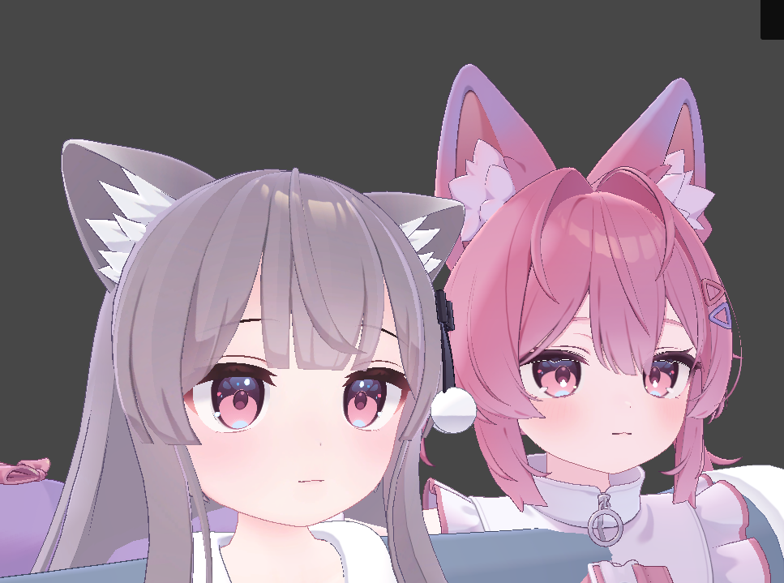

## 目的
このチュートリアルでは、別アバターの目表現を参照しながら、コピー先アバターへ割り当ててアップロード準備をするまでの流れを説明します。  
基本操作がまだ不安な場合は、先に [対応マテリアルを割り当てる（マテリアル再割り当て）](/tutorial/material-reassignment) を読むことをおすすめします。

## はじめる前に

- MANACOのインストールが完了している。
- コピー元として参照したいアバターPrefabを用意している。

まだインストールが終わっていない場合は、先に [インストール方法](/install) を確認してください。

## 手順1: MANACOを追加する

1. Hierarchyで対象アバターを右クリックします。
2. `ちゃとらとりー/Manaco(まなこ)` を実行します。
3. 生成された `Manaco` オブジェクトを選択します。

## 手順2: コピー元とコピー先の設定を入れる

1. `モード` を `別アバターの目をコピー` に変更します。
2. `アバタープリセット（コピー先）` を選択します。
3. `コピー元のアバター` にコピー元アバターPrefabを指定します。
4. `コピー元のアバタープリセット` を選択します。

プリセットがない場合は `【Other】その他のアバター` を選んでください。

## 手順3: コピー先の目を指定する

1. `アバタープリセット（コピー先）` の下に表示された `選ぶ` ボタンを順番に押します。
2. コピー先アバター側の左右の目を、それぞれ対応する項目へ割り当てます。
3. 必要に応じて、UVエディタ上で対象の目領域を調整します。

## 手順4: コピー元の目を指定する

1. `コピー元のアバタープリセット` の下に表示された `選ぶ` ボタンを順番に押します。
2. コピー元アバター側の左右の目を、それぞれ対応する項目へ割り当てます。
3. コピー先とコピー元の両方で、必要な項目が埋まっていることを確認します。

## 手順5: 反映結果を確認する

1. 反映結果を確認します。
2. `NDMF Preview` で見た目を確認します。
3. 問題がなければVRChatへアップロードします。

## 困ったとき

- まず基本的な設定の流れを確認したい場合は、[対応マテリアルを割り当てる（マテリアル再割り当て）](/tutorial/material-reassignment) を参照してください。
