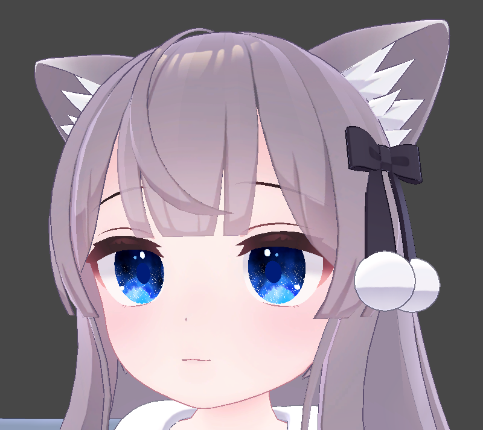
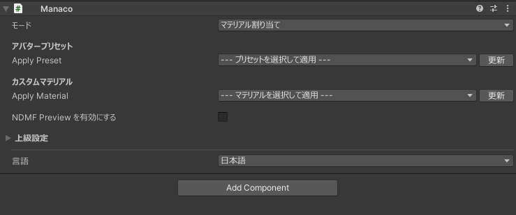
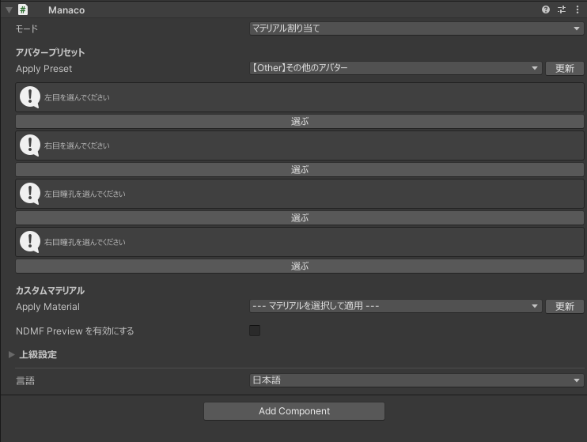
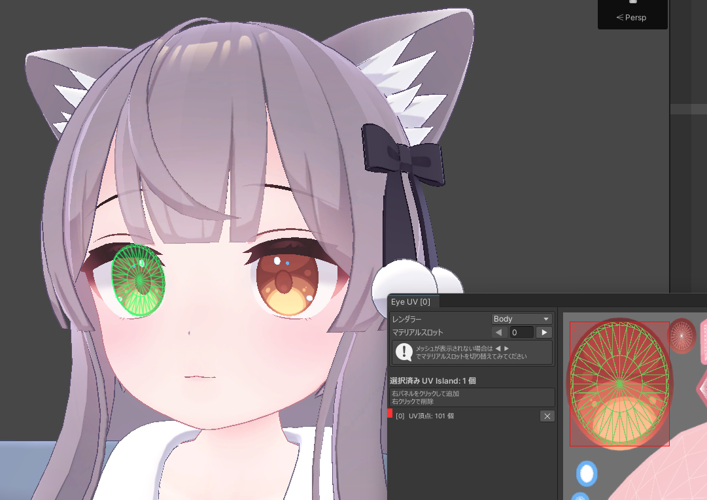

## 目的
このチュートリアルでは、MANACO対応のマテリアルをアバターに適用する方法を説明します。  
初めてMANACOを触る場合は、このページから始めてください。

## はじめる前に

- MANACOのインストールが完了している。
- MANACO対応のマテリアルデータを用意している。
- MANACO対応商品は [BOOTH](https://booth.pm/ja/search/MANACO%E5%AF%BE%E5%BF%9C) で探せます。

まだインストールが終わっていない場合は、先に [インストール方法](/install) を確認してください。

## 手順1: MANACOを追加する

1. Hierarchyで対象アバターを右クリックします。
2. `ちゃとらとりー/Manaco(まなこ)` を実行します。
3. 生成された `Manaco` オブジェクトを選択します。

## 手順2: モードを確認する

1. `モード` が `マテリアル割り当て` になっていることを確認します。

## 手順3: 左右の目領域を設定する

1. `アバタープリセット` を `【Other】その他のアバター` に設定します。
2. 未割り当ての箇所を割り当てるためのボタンが表示されるので、順番に設定します。

3. `選ぶ` を押すとUVエディタが開くので、対象の目のUV Islandを選択します。
4. 操作方法は次のとおりです。
   - 左クリックで追加します。
   - 右クリックで削除します。

## 手順4: マテリアルを適用する

1. `カスタムマテリアル` で適用したいものを選択します。
2. 各目のマテリアル割り当てが想定どおりか確認します。

## 手順5: 見た目を確認する

1. 必要に応じて `NDMF Preview` を有効化し、見た目を確認します。
2. 問題がなければVRChatへアップロードします。

## 次に読むページ

別アバターの目表現を参考にしたい場合は、[他アバターの目の割り当て](/tutorial/copy-eye-assignment) に進んでください。
